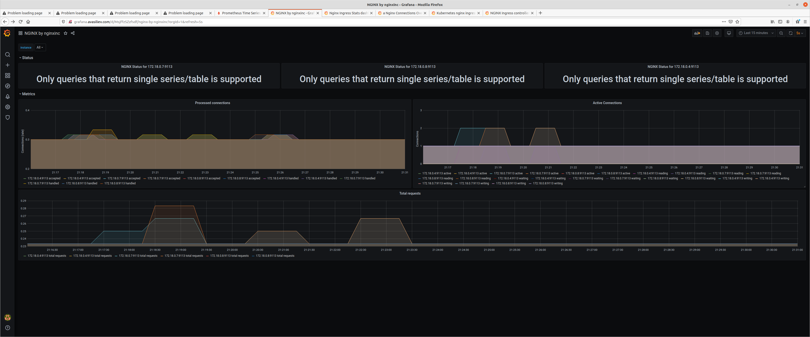

# Custom Resource Definitions. Operators

## Поднимаем Minikube

~~~ sh
minikube start
~~~

Сразу включим ingress

~~~ sh
minikube addons enable ingress
~~~

## Пишем инфраструктуру  для мониторинга через terraform и Helm

Файл с [манифестом tf](kubernetes-monitoring/tf/main.tf)

## Добавляем приложение для мониторинга

Выбран [чарт](https://github.com/bitnami/charts/tree/master/bitnami/nginx) от bitnami - в него уже включен nginx c  отдачей метрик и Nginx Exporter.

Активируем требование по количеству реплик и мониторинг

~~~ json
  set {
    name  = "replicaCount"
    value = "3"
  }

  set {
    name  = "metrics.enabled"
    value = "true"
  }
~~~

## Добавляем Prometheus для мониторинга

~~~ json
resource "helm_release" "prometheus" {
  name             = "prometheus"
  chart            = "./helm/prometheus"
  namespace        = "monitoring"
  create_namespace = true
  depends_on = [
    helm_release.nginx
  ]
}
~~~

Добавлем Игресс

~~~ yaml
 hosts: 
      - prometheus.avasiliev.com
~~~

Остальное он получит через Service Discovery

## Добавляем Grafana для мониторинга

~~~ json

resource "helm_release" "grafana" {
  name             = "grafana"
  chart            = "./helm/grafana"
  namespace        = "monitoring"
  create_namespace = true

 depends_on = [
    helm_release.nginx
  ]

}
~~~

Конфигурируем сразу DataSource

~~~ yaml
datasources: 
  datasources.yaml:
    apiVersion: 1
    datasources:
    - name: Prometheus
      type: prometheus
      url: http://prometheus-server
      access: proxy
      isDefault: true
    - name: Loki
      type: loki
      url: http://loki:3100
      access: proxy
      isDefault: false

~~~

Добавляем провайдеры для DashBoard

~~~ yaml
dashboardProviders: 
  dashboardproviders.yaml:
    apiVersion: 1
    providers:
    - name: 'default'
      orgId: 1
      folder: ''
      type: file
      disableDeletion: false
      editable: true
      options:
        path: /var/lib/grafana/dashboards/default

    - name: 'prometheus'
      orgId: 1
      folder: 'Prometheus K8S Cluster'
      type: file
      disableDeletion: true
      editable: true
      options:
        path: /var/lib/grafana/dashboards/prometheus

~~~

Ну и сразу немножко Дашбордов насыпем 

~~~ yaml
dashboards: 
  default:
  - file: dashboards/custom-dashboard.json
  prometheus:
    kubernetes-cluster:
      gnetId: 7249
      datasource: Prometheus
    nginx-ingress:
      gnetId: 9614
      datasource: Prometheus
    kubernetes-cluster-monitoring-prometheus:
      gnetId: 315
      datasource: Prometheus
    nginx-prometheus:
      gnetId: 11199
      datasource: Prometheus
~~~

Присыпем Ингресс

~~~ yaml
ingress:
  enabled: true
  # Values can be templated
  annotations: {}
    # kubernetes.io/ingress.class: nginx
    # kubernetes.io/tls-acme: "true"
  labels: {}
  path: /
  hosts:
    - grafana.avasiliev.com
~~~

## Все это поднимем

~~~ sh
 terraform apply -auto-approve 
~~~

Пропишем в     /etc/hosts доступы

~~~ sh
172.17.0.2 prometheus.avasiliev.com grafana.avasiliev.com
~~~

Авторизуемся и смотрим графики

PS: Иногда залипает установка чарта в  minikube, а в GKE  работает - наверно от версии k8s есть зависимости

Заметка  про устройство [Оператора](https://medium.com/kubernetes-tutorials/simple-management-of-prometheus-monitoring-pipeline-with-the-prometheus-operator-b445da0e0d1a)